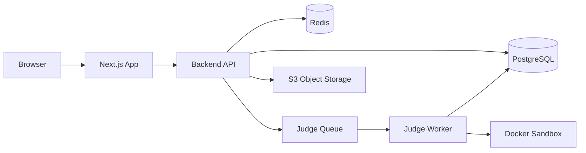
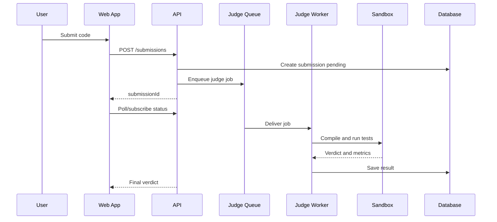
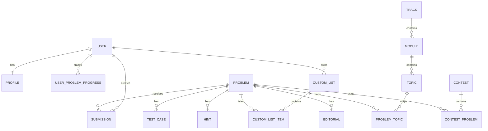

# DSA Learning Platform Product and Design Spec

Working title: `DSA Guide`

Version: 0.1
Date: 2026-06-03
Owner: Himanshu

## 1. Executive Summary

Build a structured DSA learning and practice platform inspired by the strongest parts of Take U Forward, LeetCode, NeetCode, AlgoMonster, CodeChef, HackerRank, and InterviewBit.

The product should not be another giant problem list. Its core promise is: help a learner go from confused beginner to interview-ready problem solver through a guided roadmap, topic-first teaching, pattern recognition, browser-based coding, progress tracking, revision loops, AI-assisted doubt solving, and realistic assessment.

The strongest wedge is a learning-first coding platform for Indian college students and early-career engineers who want the structure of TUF, the execution environment of LeetCode, the pattern clarity of NeetCode and AlgoMonster, and the consistency mechanics of InterviewBit/CodeChef.

## 2. Research Summary

### Take U Forward / TUF+

Observed strengths:

- Structured A2Z DSA sheet with 474 problems.
- Topic-based learning path from basics to advanced.
- Progress visible by topic, difficulty, and overall completion.
- Revision-oriented tracks: concept revision and quick revision.
- Company-specific problems.
- Video editorials, written editorials, downloadable notes, hints, AI doubt support, focus mode, daily planner, streaks, mock tests, contests, custom lists, profile tracker, and interview follow-up questions.
- Trust built through a strong instructor brand and success stories.

Product lesson:

TUF wins on clarity of path. Learners trust it because it tells them what to do next, in what order, and why.

### LeetCode

Observed strengths:

- Very large problem library, 4200+ questions.
- Online judge and code playground.
- Multiple languages, currently described as 14 popular coding languages.
- Problemset filters, study plans, lists, community discussions, contests, company tags, premium content, mock interviews, editorials, and priority judging.
- Strong developer identity and interview-prep brand.

Product lesson:

LeetCode wins on practice infrastructure, breadth, contests, social proof, and the feeling of being the default place where engineers practice.

### NeetCode

Observed strengths:

- Roadmaps and curated lists such as Blind 75, NeetCode 150, NeetCode 250.
- Problems grouped by patterns and topics.
- Free video explanations, code solutions, progress tracking, Discord community.
- Courses for DSA, advanced algorithms, system design, Python, SQL, full-stack, and object-oriented design.

Product lesson:

NeetCode wins by reducing noise. The learner sees a small number of high-value problems in an order that builds pattern recognition.

### AlgoMonster

Observed strengths:

- Pattern-first curriculum.
- Flowchart-based problem solving.
- Templates for recurring algorithm patterns.
- Inline IDE, AI assistance, algorithm visualizer, speedrun mode, quizzes, and guided practice.
- Framing around mastering patterns instead of randomly grinding thousands of problems.

Product lesson:

AlgoMonster wins on deep pedagogy. It teaches learners how to recognize problem types and apply reusable templates.

### CodeChef

Observed strengths:

- Courses, guided roadmaps, built-in compiler, AI mentor, real-world problems, contests, ratings, certificates, and college/enterprise dashboards.
- Strong positioning for students moving from beginner to job-ready.
- Practice sorted by difficulty, 30+ languages and technologies, global contests, and progress dashboards.

Product lesson:

CodeChef wins on habit, contest motivation, and institutional adoption.

### HackerRank

Observed strengths:

- Prep kits that mirror hiring process: practice challenges, mock tests, AI mock interviews, and role certifications.
- Timed auto-evaluated assessments and personalized reports.
- Integrity controls for assessment contexts.

Product lesson:

HackerRank wins when practice becomes assessment. It maps learning to hiring workflows.

### InterviewBit

Observed strengths:

- Practice organized by topic and difficulty.
- Timers, streaks, mock assessments, free mock interviews, expert guides, video explanations, and a strong emphasis on corner cases and first-attempt correctness.

Product lesson:

InterviewBit wins on discipline and feedback. It helps learners understand where they stand and creates daily practice momentum.

## 3. Product Vision

Create the most beginner-friendly DSA mastery platform for interview preparation: structured like a course, practical like LeetCode, pattern-driven like NeetCode/AlgoMonster, and motivating like CodeChef.

The platform should answer five questions for every learner:

1. What should I learn next?
2. Why does this pattern matter?
3. Can I solve it myself in a real editor?
4. What exactly went wrong when I failed?
5. Am I ready for interviews?

## 4. Target Users

### Primary Persona: Beginner College Student

Profile:

- 1st to 3rd year CS/IT student or self-taught learner.
- Knows one programming language basics but lacks DSA structure.
- Feels overwhelmed by LeetCode volume.
- Wants a clear path for internships and placements.

Needs:

- Basics explained step by step.
- Roadmap with daily tasks.
- Guided problem order.
- Hints without feeling stuck forever.
- Progress and streak motivation.

### Secondary Persona: Placement-Focused Learner

Profile:

- Final-year student or early-career developer preparing for campus or off-campus interviews.
- Has solved some problems but lacks consistency and revision.

Needs:

- Company-specific practice.
- Timed mock tests.
- Revision sheets.
- Interview follow-up questions.
- Weak-area analytics.

### Tertiary Persona: Advanced Problem Solver

Profile:

- Comfortable with DSA basics.
- Wants to improve speed, pattern recognition, and contest performance.

Needs:

- Hard problems.
- Contest mode.
- Advanced patterns.
- Peer leaderboard.
- Detailed editorials and alternate approaches.

### Future Persona: College Admin / Instructor

Profile:

- Institution or mentor managing a cohort.

Needs:

- Assignments.
- Student progress dashboard.
- Custom roadmaps.
- Contest hosting.
- Performance reports.

## 5. Positioning

### One-Line Positioning

A guided DSA learning and coding practice platform that takes learners from basics to interview-ready through roadmaps, pattern-based practice, AI doubt support, and real coding assessments.

### Differentiation

Compared with LeetCode:

- More structured for beginners.
- Better learning sequence and topic explanations.
- More emphasis on why a pattern works.

Compared with TUF:

- Native coding environment and online judge.
- Better submission analytics and personalized review loops.
- More interactive learning widgets and practice modes.

Compared with NeetCode:

- More complete beginner-to-advanced course experience.
- More Indian placement-oriented features: company tags, campus mock tests, daily planner.

Compared with AlgoMonster:

- More accessible pricing and stronger problem platform/community layer.
- More practical coding, contests, and career-prep modes.

## 6. Product Principles

1. Path over pile: always show the learner the next best step.
2. Learn, solve, reflect: every topic should combine concept, practice, feedback, and revision.
3. Hints before answers: preserve struggle while reducing helplessness.
4. Pattern recognition over memorization: teach reusable templates and decision trees.
5. Real interview readiness: measure speed, correctness, edge cases, communication, and revision strength.
6. Beginner empathy: avoid assuming CS vocabulary before teaching it.
7. Practice in public, assess in private: normal practice should be supportive; mocks should be realistic and strict.

## 7. MVP Scope

### MVP Goal

Launch a working DSA learning platform where users can follow a structured roadmap, solve problems in-browser, submit to an online judge, track progress, and read guided editorials.

### MVP Feature Set

Must have:

- Authentication.
- Dashboard.
- A2Z-style roadmap.
- Topic pages.
- Problem library.
- Problem detail page.
- Browser code editor.
- Code execution against sample tests.
- Submission judging against hidden tests.
- Supported languages: Python, C++, Java, JavaScript.
- Progress tracking.
- Hints and written editorials.
- Basic user profile.
- Admin/content management for problems and topics.

Should have:

- Daily plan.
- Streaks.
- Bookmarks/custom lists.
- Revision mode.
- Difficulty/topic/company filters.
- Leaderboard for contests or weekly challenges.

Not in MVP:

- Full AI tutor.
- Video courses.
- Payment/subscription.
- Institution dashboards.
- Plagiarism detection.
- Pair interviews.
- Mobile app.

## 8. Information Architecture

Primary navigation:

- Dashboard
- Roadmap
- Problems
- Practice Lists
- Contests
- Discuss
- Profile

Secondary learner tools:

- Daily Plan
- Revision Queue
- Bookmarks
- Submissions
- Notes

Admin navigation:

- Problems
- Topics
- Test Cases
- Roadmaps
- Editorials
- Users
- Reports

## 9. Core User Flows

### Flow 1: New Learner Onboarding

1. User signs up.
2. User selects goal: beginner DSA, campus placement, FAANG-style interview, revision, competitive programming.
3. User selects timeline: 30 days, 60 days, 90 days, 6 months.
4. User selects primary language.
5. Platform generates starter roadmap and first daily plan.
6. User lands on dashboard with `Start Today's First Problem` as the primary action.

### Flow 2: Learn a Topic

1. User opens roadmap.
2. User selects `Arrays`.
3. Topic page shows concept notes, pattern summary, prerequisite status, and ordered problem list.
4. User reads short concept explanation.
5. User solves first guided problem.
6. Platform updates topic progress and recommends the next problem.

### Flow 3: Solve a Problem

1. User opens problem.
2. Problem statement shows examples, constraints, tags, companies, and acceptance stats.
3. User writes code in editor.
4. User runs sample tests.
5. User submits.
6. Judge returns verdict: Accepted, Wrong Answer, TLE, MLE, Runtime Error, Compilation Error.
7. If failed, user can reveal progressive hints.
8. If accepted, user sees runtime, memory, editorial, alternate approaches, and follow-up questions.

### Flow 4: Revision Mode

1. User opens Revision Queue.
2. Platform lists problems due for review based on spaced repetition.
3. User solves without seeing old code by default.
4. After solving, user can compare with previous solution.
5. Queue reschedules the problem based on result and confidence.

### Flow 5: Mock Test

1. User chooses target: generic DSA, company-specific, topic-specific.
2. Platform creates timed set of 2 to 4 problems.
3. User solves in strict mode.
4. Platform shows score, solved count, time per problem, failed test categories, topic gaps, and recommended revision.

## 10. Feature Specifications

### 10.1 Dashboard

Purpose:

Give the learner one calm place to decide what to do today.

Core elements:

- Today's plan.
- Current roadmap progress.
- Streak and weekly consistency.
- Due revision count.
- Recently attempted problems.
- Weak topics.
- Recommended next problem.

Empty state:

- Ask user to select a goal and timeline.
- Offer default beginner roadmap.

Success metric:

- Percentage of active users who start a problem from dashboard.

### 10.2 Roadmap

Purpose:

Replicate the clarity of TUF A2Z while adding personalization and native solving.

Roadmap structure:

- Track
- Module
- Topic
- Lesson
- Problem

Example modules:

1. Programming basics and complexity.
2. Arrays and hashing.
3. Strings.
4. Sorting.
5. Binary search.
6. Two pointers and sliding window.
7. Recursion and backtracking.
8. Linked lists.
9. Stack and queue.
10. Heap and priority queue.
11. Trees.
12. Binary search trees.
13. Graphs.
14. Greedy.
15. Dynamic programming.
16. Tries.
17. Bit manipulation.
18. Math and geometry.
19. Interview revision.

Roadmap features:

- Progress per module.
- Locking optional prerequisites.
- Difficulty mix.
- Random problem button.
- Mark for revision.
- Notes per topic.

### 10.3 Problem Library

Purpose:

Provide LeetCode-style exploration once the learner knows what they want.

Filters:

- Difficulty.
- Topic.
- Pattern.
- Company.
- Status.
- Acceptance rate.
- Frequency.
- Roadmap membership.
- Free/premium.

Problem row fields:

- Title.
- Difficulty.
- Status.
- Topics.
- Pattern.
- Companies.
- Acceptance rate.
- Last attempted.

### 10.4 Problem Detail and IDE

Layout:

- Left panel: problem statement, examples, constraints, hints, editorial, discussion.
- Right panel: code editor, language selector, test cases, results, submission history.

Required IDE capabilities:

- Monaco editor.
- Language templates.
- Run sample tests.
- Add custom test case.
- Submit for judging.
- Persist draft code.
- Reset to template.
- View previous submissions.

Verdicts:

- Accepted.
- Wrong Answer.
- Time Limit Exceeded.
- Memory Limit Exceeded.
- Runtime Error.
- Compilation Error.
- Judge Error.

### 10.5 Hints and Editorials

Hint philosophy:

Hints should reveal thinking steps, not full code too early.

Hint levels:

1. Restate the core observation.
2. Name the pattern.
3. Explain data structure choice.
4. Provide pseudocode.
5. Link to full editorial.

Editorial structure:

- Intuition.
- Brute force.
- Optimized approach.
- Complexity.
- Edge cases.
- Code in supported languages.
- Common mistakes.
- Follow-up questions.

### 10.6 Progress Tracking

Track:

- Problems solved.
- Problems attempted.
- Acceptance rate.
- Current streak.
- Longest streak.
- Topic mastery.
- Revision due.
- Average time to solve.
- First-attempt correctness.
- Language usage.

Topic mastery formula:

- 40 percent completion.
- 20 percent recent revision success.
- 20 percent medium/hard coverage.
- 20 percent first-attempt or low-hint solves.

### 10.7 Daily Planner

Purpose:

Turn a long roadmap into manageable daily action.

Inputs:

- Target deadline.
- Daily available time.
- Current level.
- Weak topics.

Output:

- 1 concept lesson.
- 2 to 4 problems.
- Revision tasks.
- Optional challenge.

### 10.8 Revision System

Problem states:

- New.
- Attempted.
- Solved.
- Needs revision.
- Mastered.

Revision triggers:

- User marks problem for revision.
- Solved with hints.
- Wrong answer more than 2 times.
- Took much longer than target.
- Topic is weak.

Suggested intervals:

- After 1 day.
- After 3 days.
- After 7 days.
- After 21 days.
- After 45 days.

### 10.9 Custom Lists

List types:

- User-created lists.
- Official lists.
- Company lists.
- Topic sprint lists.
- Revision lists.

Actions:

- Create list.
- Add/remove problem.
- Fork public list.
- Share list.
- Track progress independently.

### 10.10 Contests

MVP-lite contest support:

- Weekly challenge.
- Timed leaderboard.
- Problem set.
- Rank by solved count, penalty time, and submission time.

Later:

- Rated contests.
- College contests.
- Private contests.
- Editorial release after contest.

### 10.11 AI Doubt Support

Phase 2 feature.

Use cases:

- Explain problem statement.
- Explain failed test case.
- Give progressive hint.
- Review code for bug categories.
- Generate similar practice.
- Explain editorial in simpler language.

Safety/product constraints:

- AI should not reveal full solution in mock-test mode.
- AI hints should follow configured reveal levels.
- AI responses should reference official editorial when available.
- Store conversation per problem for learner review.

### 10.12 Discussion and Community

MVP:

- Problem comments.
- User solution posts.
- Sort by newest, most liked, language.

Later:

- Topic communities.
- Mentor answers.
- Cohorts.
- College groups.

## 11. UX Design Direction

### Product Feel

The app should feel like a focused learning workspace, not a marketing website. Think dense, calm, practical, and fast.

Recommended visual direction:

- Developer-tool inspired layout.
- Neutral background.
- Clear typographic hierarchy.
- Strong status colors for progress and verdicts.
- Minimal cards, mostly structured panels and tables.
- Dark mode from early stage because coding practice often happens at night.

Suggested design references:

- Linear for precise dashboard feel.
- Vercel for clean monochrome developer surfaces.
- Supabase for dark code-oriented UI, but avoid becoming too green-heavy.
- LeetCode for problem-solving layout patterns.

### Layout Principles

- Primary action always visible: `Continue Roadmap`, `Run`, `Submit`, or `Review`.
- Problem pages must avoid vertical jumping while test results load.
- Roadmap should be scan-friendly with visible completion and current position.
- Tables should support keyboard-friendly navigation.
- Mobile should support reading and progress, but solving can be optimized first for desktop/tablet.

### Key Screens

#### Dashboard Screen

Sections:

- Top bar with search, profile, streak.
- Left sidebar navigation.
- Main: today's plan and active roadmap.
- Right rail: streak, weak topics, revision due.

Primary CTA:

- Continue today's plan.

#### Roadmap Screen

Sections:

- Track selector.
- Module accordion.
- Topic progress rows.
- Current topic highlighted.
- Mini analytics: solved/easy/medium/hard.

#### Problem Page

Desktop layout:

- Split pane.
- Left: statement/editorial tabs.
- Right: editor/results tabs.
- Bottom/right result panel with stable height.

Mobile layout:

- Tabs: Statement, Code, Results, Editorial.
- Sticky run/submit action bar.

#### Profile Screen

Sections:

- Stats overview.
- Heatmap.
- Topic mastery chart.
- Recent submissions.
- Public lists.
- Badges.

## 12. System Architecture

### Recommended Tech Stack

Frontend:

- Next.js with TypeScript.
- Tailwind CSS.
- shadcn/ui or Radix UI primitives.
- Monaco editor.
- TanStack Query for server state.
- Zustand or React context for local UI state.

Backend:

- Node.js with NestJS or Express/Fastify.
- PostgreSQL.
- Redis for queues, rate limits, sessions, and judge job status.
- Prisma or Drizzle ORM.

Judge service:

- Separate worker service.
- Docker-based isolated execution.
- Queue with BullMQ or similar.
- Resource limits per run: CPU time, memory, output size, file system access.

Storage:

- S3-compatible object storage for editorial assets, videos, and large test bundles.

Auth:

- Email/password and OAuth via Google/GitHub.
- JWT or session cookies.

Deployment:

- Frontend on Vercel or similar.
- Backend on Render/Fly/AWS ECS.
- Judge workers on dedicated VMs or Kubernetes nodes because they need container execution.

### High-Level Architecture

### Judge Flow

## 13. Data Model

Core entities:

- User.
- Profile.
- Track.
- Module.
- Topic.
- Problem.
- ProblemTestCase.
- Editorial.
- Hint.
- Submission.
- SubmissionResult.
- UserProblemProgress.
- UserTopicProgress.
- RoadmapEnrollment.
- DailyPlan.
- CustomList.
- Contest.
- ContestProblem.
- ContestSubmission.
- DiscussionPost.

### Simplified Schema

### Problem Fields

- id.
- slug.
- title.
- difficulty.
- statement_md.
- input_format_md.
- output_format_md.
- constraints_md.
- examples_json.
- starter_code_json.
- reference_solutions_json.
- time_limit_ms.
- memory_limit_mb.
- acceptance_rate.
- is_premium.
- status.
- created_at.
- updated_at.

### Submission Fields

- id.
- user_id.
- problem_id.
- language.
- source_code.
- status.
- runtime_ms.
- memory_kb.
- tests_passed.
- total_tests.
- error_message.
- created_at.

## 14. API Surface

Auth:

- POST /auth/signup
- POST /auth/login
- POST /auth/logout
- GET /auth/me

Roadmaps:

- GET /tracks
- GET /tracks/:slug
- POST /tracks/:id/enroll
- GET /me/roadmap

Problems:

- GET /problems
- GET /problems/:slug
- GET /problems/:slug/editorial
- GET /problems/:slug/hints
- POST /problems/:slug/bookmark

Submissions:

- POST /submissions/run
- POST /submissions
- GET /submissions/:id
- GET /problems/:slug/submissions

Progress:

- GET /me/progress
- GET /me/revision
- PATCH /me/problem-progress/:problemId

Lists:

- GET /lists
- POST /lists
- GET /lists/:id
- POST /lists/:id/problems

Admin:

- POST /admin/problems
- PATCH /admin/problems/:id
- POST /admin/problems/:id/test-cases
- POST /admin/topics
- POST /admin/roadmaps

## 15. Online Judge Requirements

Security requirements:

- Run user code inside isolated containers.
- Disable network access inside sandbox.
- Limit CPU, memory, process count, output size, and wall time.
- Use read-only file system where possible.
- Never run submissions on the API server.
- Store hidden tests securely.
- Rate-limit run and submit endpoints.

Judge result requirements:

- Return first failing sample/custom case in practice mode when safe.
- Do not expose hidden test input by default.
- Provide category-level error hints: off-by-one, empty input, overflow, timeout, etc. when detectable.

Supported language MVP:

- Python 3.
- C++17 or C++20.
- Java 17.
- JavaScript Node.js LTS.

## 16. Analytics and Metrics

North star metric:

- Weekly active learners completing at least 3 meaningful practice sessions.

Activation metrics:

- Signup to first problem opened.
- Signup to first submission.
- Signup to first accepted solution.
- Onboarding completion rate.

Engagement metrics:

- Problems attempted per week.
- Daily plan completion.
- Streak retention.
- Revision queue completion.
- Average session length.

Learning metrics:

- Topic mastery growth.
- First-attempt accepted rate.
- Time-to-accepted trend.
- Hint usage trend.
- Mock test score trend.

Business metrics:

- Free to paid conversion.
- Premium feature usage.
- Course completion.
- College cohort retention.

## 17. Monetization Strategy

Free tier:

- Core roadmap.
- Limited problem set.
- Basic editor and submissions.
- Limited hints.
- Community solutions.

Pro tier:

- Full roadmap.
- Full problem bank.
- Company-specific lists.
- AI doubt support.
- Advanced analytics.
- Mock tests.
- Revision planner.
- Video/editorial depth.

Institution tier:

- Cohort dashboard.
- Assignments.
- Private contests.
- Admin analytics.
- Custom roadmaps.
- Certificates.

Important product note:

Keep the beginner path meaningfully useful for free. The brand should earn trust before charging.

## 18. MVP Roadmap

### Phase 0: Product Foundation

- Finalize brand and information architecture.
- Define 100 MVP problems.
- Create topic taxonomy and roadmap order.
- Define problem authoring format.
- Build admin import workflow.

### Phase 1: Core Platform

- Auth.
- Dashboard.
- Roadmap.
- Problem library.
- Problem detail page.
- Code editor.
- Run sample tests.
- Submit to judge.
- Submission history.
- Progress tracking.

### Phase 2: Learning Depth

- Hints.
- Editorials.
- Topic notes.
- Revision queue.
- Daily planner.
- Custom lists.

### Phase 3: Motivation and Assessment

- Streaks.
- Weekly challenges.
- Mock tests.
- Leaderboards.
- Profile stats.

### Phase 4: AI and Personalization

- AI doubt assistant.
- Failed submission explainer.
- Personalized roadmap adjustment.
- Weak-topic recommendations.

### Phase 5: Community and Monetization

- Discussion.
- Public solution posts.
- Pro plans.
- College cohorts.
- Certificates.

## 19. MVP Content Plan

Start with 100 to 150 problems, not 1000.

Suggested distribution:

- Basics and complexity: 8.
- Arrays and hashing: 15.
- Strings: 8.
- Sorting: 5.
- Binary search: 10.
- Two pointers/sliding window: 12.
- Recursion/backtracking: 10.
- Linked list: 8.
- Stack/queue: 10.
- Trees: 12.
- Graphs: 12.
- Greedy: 8.
- Dynamic programming: 12.
- Heap: 6.
- Bit manipulation/math: 6.

For each problem, author:

- Statement.
- Examples.
- Constraints.
- Starter code in 4 languages.
- Hidden tests.
- Brute force approach.
- Optimized approach.
- Complexity.
- Hints.
- Follow-up questions.

## 20. Design Acceptance Criteria

Dashboard:

- User can identify today's next action in under 5 seconds.
- User can see progress, streak, and revision due without scrolling on desktop.

Roadmap:

- User can see current topic, completed topics, and locked/upcoming topics.
- Topic rows do not shift as progress changes.

Problem page:

- User can run and submit without leaving the problem page.
- Results appear in a stable panel.
- Editor draft persists on refresh.
- Statement and editor remain usable on 1366x768 screens.

Progress:

- Solving a problem updates roadmap progress immediately after accepted verdict.
- Failed submissions are visible in history.

## 21. Engineering Acceptance Criteria

- API rejects unauthorized access to private progress and submissions.
- Judge never executes code on the API server.
- Hidden tests are not exposed to clients.
- Submissions are idempotently processed by job ID.
- Each judge job has a hard timeout.
- All problem slugs are unique.
- Admin can create/update a problem without database migrations.
- The system can support at least 100 concurrent submissions in a small beta with queued processing.

## 22. Risks and Mitigations

Risk: Online judge security is hard.

Mitigation:

- Keep judge isolated as a separate service.
- Use containers with strict limits.
- Start with trusted beta users.
- Consider managed judge APIs for earliest prototype if needed.

Risk: Content creation becomes the bottleneck.

Mitigation:

- Start with 100 high-quality problems.
- Build authoring templates early.
- Prioritize quality over volume.

Risk: AI gives away full answers and reduces learning.

Mitigation:

- Gate AI by hint level.
- Disable full-solution AI in mock mode.
- Use official editorial context.

Risk: Competing with mature platforms is difficult.

Mitigation:

- Focus on beginner structure and Indian placement use case.
- Build a strong roadmap, revision, and analytics experience before chasing problem volume.

Risk: Users churn after initial motivation.

Mitigation:

- Daily planner.
- Streaks.
- Revision queue.
- Weekly challenges.
- Visible mastery progress.

## 23. Open Questions

- Should the first version be free-only, or include Pro from the beginning?
- Will content be original, curated, or linked to external problems?
- Should the platform target Indian campus placements first or global FAANG prep first?
- Should video content be part of v1, or should written/interactive content come first?
- Should the judge be self-hosted immediately or use a third-party judge service for prototype?
- What is the preferred initial stack for this repo?

## 24. Recommended First Build

The best first build is a narrow but real vertical slice:

1. Next.js app with auth.
2. Roadmap with 3 modules: Arrays, Binary Search, Stack/Queue.
3. 20 authored problems.
4. Problem page with Monaco editor.
5. Judge worker for Python and C++ only.
6. Submission history.
7. Progress tracking.
8. Written editorials and hints.

Why this slice:

- It proves the core product loop.
- It avoids premature content scale.
- It validates judge complexity early.
- It gives users something real to learn from.

## 25. Source Notes

Research used public product pages and help/docs from:

- Take U Forward: https://takeuforward.org/
- TUF+: https://takeuforward.org/plus
- Striver A2Z DSA Sheet: https://takeuforward.org/dsa/strivers-a2z-sheet-learn-dsa-a-to-z
- LeetCode: https://leetcode.com/
- LeetCode Study Plans: https://leetcode.com/studyplan/
- LeetCode Premium Help: https://support.leetcode.com/hc/en-us/articles/360011884094-What-will-I-get-with-a-premium-subscription
- CodeChef: https://www.codechef.com/
- HackerRank Prep Kits: https://help.hackerrank.com/articles/1723224478-introduction-to-prep-kits
- Codeforces guide: https://codeforces.com/blog/entry/99660
- NeetCode: https://neetcode.io/
- NeetCode Roadmap: https://neetcode.io/roadmap
- AlgoMonster: https://algo.monster/
- AlgoMonster dashboard/release notes excerpts: https://algo.monster/dashboard
- InterviewBit: https://www.interviewbit.com/
